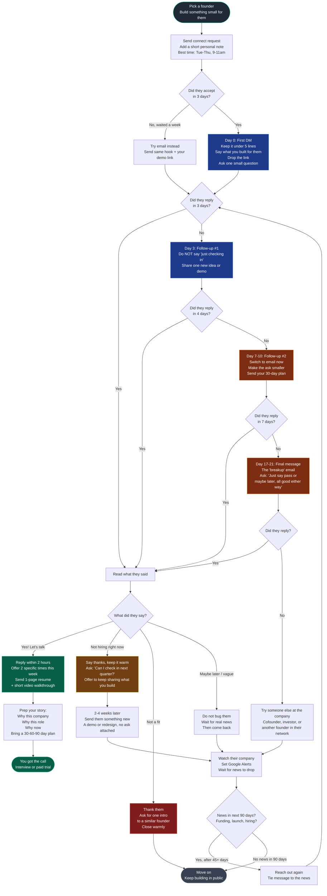

# LinkedIn Founder Outreach Playbook

A research-backed workflow for cold-messaging startup founders to get hired as a product engineer or founding engineer. Built from Reddit/HN practitioner threads, Lenny's Newsletter, First Round Review, YC's job guide, Sahil Bloom, Justin Welsh, Steli Efti, and the public hiring patterns of Linear, Vercel, PostHog, Stripe, and Cal.com.

## When to use this skill

Use this whenever a user is planning outreach to startup founders for a job, or asks for a follow-up cadence, or wants a flowchart of how to handle replies. If they describe wanting to "message founders on LinkedIn" without using the word "outreach," still use this skill.

## What makes this different from generic job outreach

Founders hiring for product engineer / founding engineer roles screen on **taste + speed + ownership**, not resume keywords. The outreach must show, not tell:

- Build something for the founder before the first DM (a Loom, a redesign, a microfeature)
- The artifact qualifies the candidate before the message is read
- Loom or built artifact lifts reply rate from ~4% to ~22% at the same volume

## Numbers that drive the cadence

| Lever | Data |
|---|---|
| Free connection request with personalised note | 35-45% accept vs 15-25% for InMail |
| Loom / built artifact attached | 4% → 22% reply rate |
| Message under 80 words / 400 chars | +22% reply lift |
| Cadence covering Day 0 → Day 17 | Captures ~93% of all replies that will ever come |
| Cumulative reply lift per follow-up | T2 +21%, T3 +25%, T4 +28%, diminishes after |
| Best send window | Tue-Thu 9-11am recipient local; founders also over-index Sun eve / Sat morn |
| Hiring sequence ceiling | 4-5 touches max; past that reads desperate |
| Breakup message alone | Triggers 30-50% of total sequence replies |

## Pre-flight checklist (before any DM)

1. Public footprint up: portfolio site shipped on the founder's stack, 1-2 build-in-public posts, GitHub green
2. Pick ONE concrete role to ask for ("first product engineer" / "founding engineer") — never "anything"
3. Build the artifact for THIS founder: 60-90 sec Loom OR redesign of their broken page OR working microfeature
4. Find founder's `founder@` or `first.last@` email as the channel-2 backup

## The flowchart

## Cadence at a glance

| Touch | Day | Channel | Purpose |
|---|---|---|---|
| Connect | 0 | LinkedIn | Free request + personalised note (no pitch inside) |
| T1 | +0 from accept | LinkedIn DM | Hook + Loom/artifact + tiny ask |
| T2 | +3 | LinkedIn DM | NEW value, second artifact |
| T3 | +7-10 | Email (switch channel) | Smaller ask, 30-day plan |
| T4 | +17-21 | Email | Breakup: "pass or circle-back?" |
| T5 | +45 onwards | Email/LinkedIn | Only on trigger event (fund/launch/hire) |

## Message templates

### Connection note (under 280 chars)
> Hi {first name} — saw your post on {specific thing, last 14 days}. Built a {Loom / redesign / micro-feature} for {their product} that fixes {specific pain}. Mind if I send it over?

### T1 — Day 0 (after connection accepted)
> Thanks for connecting. Quick context: I'm a product engineer (shipped {1 specific outcome}). Noticed {specific thing on their product / their recent post}. Built this in {timeframe}: {Loom link}. If it's useful, happy to walk you through how I'd extend it. If not, no worries — figured it was easier to show than tell.

### T2 — Day 3 bump (NEW value, never "just following up")
> One more thought on {topic from T1}: {1 insight or second artifact}. {Link}. Worth a 15-min chat?

### T3 — Day 7-10 channel switch (EMAIL)
> {first name} — sent you a Loom on LinkedIn last week ({link}). Smaller ask: can I send you a 30-day plan for what I'd ship as your first product engineer? One page, no call needed.

### T4 — Day 17-21 breakup
> Last note from me on this — totally understand if the timing is off. Would a one-word reply help? "pass" or "circle back" and I'll respect either. Either way, will keep building.

### Positive reply
> Awesome — I'm free {slot 1} or {slot 2} this week. Sending a 1-page resume + the 30/60/90 I'd run in your first quarter. Loom walkthrough here: {link}.

### Soft-no reply
> Totally get it — appreciate the honesty. Mind if I keep building things in your space and share when something's worth your time? Will only ping when there's a real artifact attached.

### Hard-no reply
> Understood, thanks for the straight answer. One ask: any other founder in your network building something similar I should be talking to?

## Hard rules

These are non-negotiable because each one is backed by either reply-rate data or a documented founder-blocker pattern:

1. Never attach a CV to a cold DM — link to a portfolio page instead. Founders won't open attachments from strangers
2. Never send a default "I'd like to add you" connection request — costs 30+ points of acceptance rate
3. Never pitch inside the connection note — connect first, DM second
4. Never send T2/T3 with "just following up" — every touch must carry new value
5. Never escalate to a personal email or to the cofounder after a hard no
6. Never mass-send across 3+ people at the same 5-person startup — looks like spam to all of them
7. Always message Tue-Thu 9-11am local OR Sun eve / Sat morn for founders specifically
8. Always ship the artifact before the first DM — the artifact qualifies you faster than any sentence
9. Cap LinkedIn follow-ups at 2 — third touch switches channel, fourth is the breakup
10. One concrete role, not "anything" — picking signals taste

## Volume + funnel math

Tight personalisation per founder takes 20-30 min (artifact + research). Don't scale by volume — scale by artifact quality.

Expected funnel at this quality bar:
- 30 connection requests → ~12-14 accepts (40%)
- 12 T1 sends → ~3-4 replies after full sequence (22-30% with artifact)
- 3-4 conversations → 1-2 work trials / serious processes
- Time to first real conversation: typically 7-21 days from T1

Target list size: 30-50 founders matching your stack/category. Not 500.

## How to use this skill in practice

When a user asks for help with founder outreach:

1. Confirm the role they're targeting (product engineer? founding engineer? designer-engineer?) and their target company list size
2. Walk them through the pre-flight checklist and check what they already have built
3. If they have no artifact ready, pause outreach planning and help them ship one first — that's the single highest-ROI lever in the whole sequence
4. Present the flowchart and adapt the templates to their voice, the founder's name, and the specific artifact
5. Set up the cadence as calendar reminders or a tracking sheet (one row per founder, columns for each touch + reply status)
6. When the user comes back with a reply they received, classify it (positive / soft no / hard no / vague) and walk them through the matching branch

## Source research

The cadence numbers, day/time data, and reply-rate lift figures come from:
- Steli Efti / Close.io cold email follow-up plan
- Sahil Bloom's cold email guide
- Justin Welsh's cold DM newsletter
- YC Startup Job Guide and First Round Review's "Mine Your Network for Early-Stage Hiring Gold"
- Loom + Intercom case studies on artifact-attached reply rates
- Apollo, Salesbread, and Gong cold outreach personalisation data
- Linear, Vercel, PostHog public statements on hiring product engineers (Karri Saarinen, Guillermo Rauch, Lee Robinson)
